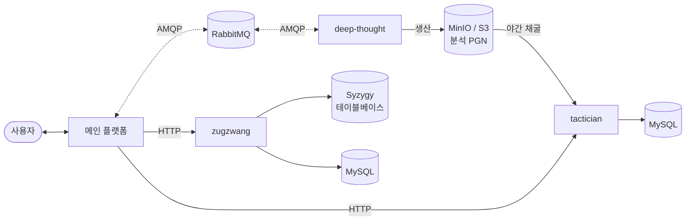

# ilovepawn

 

**한국어** · [English](README.md)

---

## 아키텍처

S3 호환 버킷에 저장되는 분석 PGN이 서비스 간 계약 역할을 합니다 — `deep-thought`가 생산하고 `tactician`이 소비합니다.

---

## 서비스

| 레포 | 역할 | 스택 |
|---|---|---|
| [**deep-thought**](https://github.com/ilovepawn/deep-thought) | 게임 분석 워커 — RabbitMQ 기반 Stockfish로 분석 PGN 생성 | Python · RabbitMQ · Stockfish · MinIO |
| [**tactician**](https://github.com/ilovepawn/tactician) | 전술 퍼즐 서비스 — 매일 Stockfish 채굴 + HTTP API | Python · FastAPI · MySQL · Stockfish |
| [**zugzwang**](https://github.com/ilovepawn/zugzwang) | 엔드게임 트레이너 — Syzygy 테이블베이스 기반 완벽 대국 상대 | Python · FastAPI · MySQL · Syzygy |

---

Built by <a href="https://github.com/FickleBoBo">@FickleBoBo</a>

