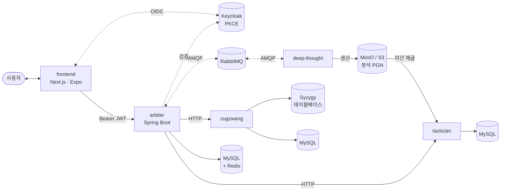

 

<!-- Frontend -->

<!-- Backend -->

<!-- Infra -->

**한국어** · [English](README.md)

---

## 아키텍처

`arbiter`는 사용자 대면 API 게이트웨이이자 Keycloak OAuth2 리소스 서버이며, `frontend`가 유일한 클라이언트 표면입니다. S3 호환 버킷에 저장되는 분석 PGN이 서비스 간 계약 역할을 합니다 — `deep-thought`가 생산하고 `tactician`이 소비합니다.

---

## 서비스

<a href="https://github.com/ilovepawn/frontend">
  <picture>
    <source media="(prefers-color-scheme: dark)" srcset="https://github-readme-stats.vercel.app/api/pin/?username=ilovepawn&repo=frontend&theme=tokyonight&show_owner=false" />
    
  </picture>
</a>
<a href="https://github.com/ilovepawn/arbiter">
  <picture>
    <source media="(prefers-color-scheme: dark)" srcset="https://github-readme-stats.vercel.app/api/pin/?username=ilovepawn&repo=arbiter&theme=tokyonight&show_owner=false" />
    
  </picture>
</a>
<a href="https://github.com/ilovepawn/deep-thought">
  <picture>
    <source media="(prefers-color-scheme: dark)" srcset="https://github-readme-stats.vercel.app/api/pin/?username=ilovepawn&repo=deep-thought&theme=tokyonight&show_owner=false" />
    
  </picture>
</a>
<a href="https://github.com/ilovepawn/tactician">
  <picture>
    <source media="(prefers-color-scheme: dark)" srcset="https://github-readme-stats.vercel.app/api/pin/?username=ilovepawn&repo=tactician&theme=tokyonight&show_owner=false" />
    
  </picture>
</a>
<a href="https://github.com/ilovepawn/zugzwang">
  <picture>
    <source media="(prefers-color-scheme: dark)" srcset="https://github-readme-stats.vercel.app/api/pin/?username=ilovepawn&repo=zugzwang&theme=tokyonight&show_owner=false" />
    
  </picture>
</a>

 

| 레포 | 계층 | 역할 | 스택 |
|---|---|---|---|
| [**frontend**](https://github.com/ilovepawn/frontend) | 클라이언트 | pnpm 모노레포 — 현재 Next.js 웹, Expo 모바일은 예정. Keycloak에 직접 인증, Arbiter에는 Bearer JWT 전달. | TypeScript · Next.js 16 · Tailwind v4 · shadcn/ui · Zustand · TanStack Query · chess.js · chessground · Stockfish (WASM) |
| [**arbiter**](https://github.com/ilovepawn/arbiter) | 게이트웨이 | API 게이트웨이 겸 OAuth2 리소스 서버. 플랫폼 상태를 집약하고, `deep-thought`로 분석 작업을 중개하며, 퍼즐·엔드게임 호출을 프록시. | Java 21 · Spring Boot 3.5 · Keycloak · MySQL · Redis · RabbitMQ · Flyway · Prometheus · Grafana |
| [**deep-thought**](https://github.com/ilovepawn/deep-thought) | 워커 | 게임 분석 워커 — RabbitMQ 기반 Stockfish로 분석 PGN 생성. | Python · RabbitMQ · Stockfish · MinIO |
| [**tactician**](https://github.com/ilovepawn/tactician) | 서비스 | 전술 퍼즐 서비스 — 매일 Stockfish 채굴 + HTTP API. | Python · FastAPI · MySQL · Stockfish |
| [**zugzwang**](https://github.com/ilovepawn/zugzwang) | 서비스 | 엔드게임 트레이너 — Syzygy 테이블베이스 기반 완벽 대국 상대. | Python · FastAPI · MySQL · Syzygy |

---

Built by <a href="https://github.com/FickleBoBo">@FickleBoBo</a>

