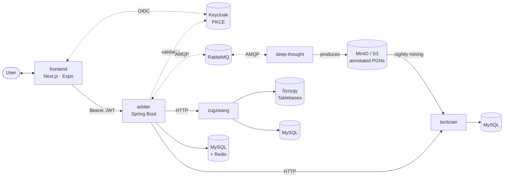

 

<!-- Frontend -->

<!-- Backend -->

<!-- Infra -->

[한국어](README.ko.md) · **English**

---

## Architecture

`arbiter` is the user-facing API gateway and Keycloak OAuth2 resource server; `frontend` is the only client surface. Annotated PGNs in the shared S3-compatible bucket form the cross-service contract — `deep-thought` produces them, `tactician` consumes them.

---

## Services

<a href="https://github.com/ilovepawn/frontend">
  <picture>
    <source media="(prefers-color-scheme: dark)" srcset="https://github-readme-stats.vercel.app/api/pin/?username=ilovepawn&repo=frontend&theme=tokyonight&show_owner=false" />
    
  </picture>
</a>
<a href="https://github.com/ilovepawn/arbiter">
  <picture>
    <source media="(prefers-color-scheme: dark)" srcset="https://github-readme-stats.vercel.app/api/pin/?username=ilovepawn&repo=arbiter&theme=tokyonight&show_owner=false" />
    
  </picture>
</a>
<a href="https://github.com/ilovepawn/deep-thought">
  <picture>
    <source media="(prefers-color-scheme: dark)" srcset="https://github-readme-stats.vercel.app/api/pin/?username=ilovepawn&repo=deep-thought&theme=tokyonight&show_owner=false" />
    
  </picture>
</a>
<a href="https://github.com/ilovepawn/tactician">
  <picture>
    <source media="(prefers-color-scheme: dark)" srcset="https://github-readme-stats.vercel.app/api/pin/?username=ilovepawn&repo=tactician&theme=tokyonight&show_owner=false" />
    
  </picture>
</a>
<a href="https://github.com/ilovepawn/zugzwang">
  <picture>
    <source media="(prefers-color-scheme: dark)" srcset="https://github-readme-stats.vercel.app/api/pin/?username=ilovepawn&repo=zugzwang&theme=tokyonight&show_owner=false" />
    
  </picture>
</a>

 

| Repo | Layer | Role | Stack |
|---|---|---|---|
| [**frontend**](https://github.com/ilovepawn/frontend) | Client | pnpm monorepo — Next.js web today, Expo mobile planned. Talks to Keycloak directly and to Arbiter as Bearer JWT. | TypeScript · Next.js 16 · Tailwind v4 · shadcn/ui · Zustand · TanStack Query · chess.js · chessground · Stockfish (WASM) |
| [**arbiter**](https://github.com/ilovepawn/arbiter) | Gateway | API gateway and OAuth2 resource server. Aggregates platform state, brokers analysis jobs to `deep-thought`, proxies puzzle and endgame calls. | Java 21 · Spring Boot 3.5 · Keycloak · MySQL · Redis · RabbitMQ · Flyway · Prometheus · Grafana |
| [**deep-thought**](https://github.com/ilovepawn/deep-thought) | Worker | Game analysis worker — RabbitMQ-driven Stockfish producing annotated PGNs. | Python · RabbitMQ · Stockfish · MinIO |
| [**tactician**](https://github.com/ilovepawn/tactician) | Service | Tactical puzzle service — daily Stockfish mining + HTTP API. | Python · FastAPI · MySQL · Stockfish |
| [**zugzwang**](https://github.com/ilovepawn/zugzwang) | Service | Endgame trainer — perfect-play opponent via Syzygy tablebases. | Python · FastAPI · MySQL · Syzygy |

---

Built by <a href="https://github.com/FickleBoBo">@FickleBoBo</a>

