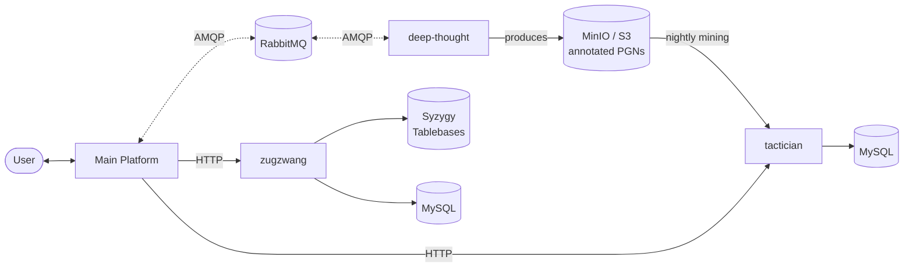

 

[한국어](README.ko.md) · **English**

---

## Architecture

Annotated PGNs in the shared S3-compatible bucket act as the cross-service contract — `deep-thought` produces them, `tactician` consumes them.

---

## Services

<a href="https://github.com/ilovepawn/deep-thought">
  <picture>
    <source media="(prefers-color-scheme: dark)" srcset="https://github-readme-stats.vercel.app/api/pin/?username=ilovepawn&repo=deep-thought&theme=tokyonight&show_owner=false" />
    
  </picture>
</a>
<a href="https://github.com/ilovepawn/tactician">
  <picture>
    <source media="(prefers-color-scheme: dark)" srcset="https://github-readme-stats.vercel.app/api/pin/?username=ilovepawn&repo=tactician&theme=tokyonight&show_owner=false" />
    
  </picture>
</a>
<a href="https://github.com/ilovepawn/zugzwang">
  <picture>
    <source media="(prefers-color-scheme: dark)" srcset="https://github-readme-stats.vercel.app/api/pin/?username=ilovepawn&repo=zugzwang&theme=tokyonight&show_owner=false" />
    
  </picture>
</a>

 

| Repo | Role | Stack |
|---|---|---|
| [**deep-thought**](https://github.com/ilovepawn/deep-thought) | Game analysis worker — RabbitMQ-driven Stockfish producing annotated PGNs | Python · RabbitMQ · Stockfish · MinIO |
| [**tactician**](https://github.com/ilovepawn/tactician) | Tactical puzzle service — daily Stockfish mining + HTTP API | Python · FastAPI · MySQL · Stockfish |
| [**zugzwang**](https://github.com/ilovepawn/zugzwang) | Endgame trainer — perfect-play opponent via Syzygy tablebases | Python · FastAPI · MySQL · Syzygy |

---

Built by <a href="https://github.com/FickleBoBo">@FickleBoBo</a>

